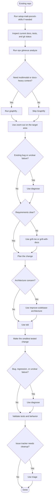

# Getting Started: Existing Project Workflow

Use this flow when you are joining, inheriting, or returning to an existing
repository. The goal is to orient before editing, build a repo-aware context
layer, diagnose unclear failures before planning around them, and then make the
smallest tested change.

For skill details, see
[Engineering Skills Guide: Matt Pocock's `mattpocock/skills`](mattpocock-skills-guide.md).
For GitNexus and Graphify setup, verification, and gitignore guidance, see
[Repo Tools Guide: Choosing Between Graphify and GitNexus](repo-tools-guide.md).

## Install the workflow tools

Install the engineering skills and repository-analysis tools together:

```bash
./install-skills.sh --eng --repo-tools
```

This installs the `--eng` skills used for orientation, diagnosis, requirements
clarification, architecture review, TDD, and issue hygiene. It also installs the
`--repo-tools` packages used for repository context.

## Bootstrap the repo if needed

Run `setup-matt-pocock-skills` once if the repository has not already been
prepared for these skills. Existing projects may already have an `AGENTS.md` or
`CLAUDE.md` agent-skills block and `docs/agents/` structure; if not, bootstrap
before depending on the other workflow skills.

## Start with orientation

Before using repo tools or changing code, inspect the current repository state:

1. Read the project README and any local contribution or architecture docs.
2. Check the test layout and the command used to run the relevant tests.
3. Check git status so local changes are not mistaken for the baseline.

This gives the repo-analysis tools and workflow skills a more accurate frame.

## Repository tools

Run GitNexus first for active coding context:

```bash
npx gitnexus analyze
```

Run setup when wiring agent integration for the project:

```bash
npx gitnexus setup
```

Use Graphify only when docs-heavy, research-heavy, diagram-heavy, or multimodal
context matters:

```bash
graphify .
```

Generated outputs such as `.gitnexus/` and `graphify-out/` are local analysis
artifacts by default. Do not treat them as source files to commit unless you
intentionally curate an output. Defer to
[Repo Tools Guide: Choosing Between Graphify and GitNexus](repo-tools-guide.md)
for gitignore and verification details.

## Recommended order

1. Run `setup-matt-pocock-skills` once if the repo needs it.
2. Inspect current docs, tests, and git status.
3. Run `npx gitnexus analyze`.
4. Run `npx gitnexus setup` when wiring agent integration.
5. Run `graphify .` only when docs-heavy or multimodal context matters.
6. Use `zoom-out` on the target area before editing unfamiliar code.
7. Use `diagnose` before planning when the task starts from a bug, regression,
   flaky behavior, or unclear failure.
8. Use `grill-me` or `grill-with-docs` when requirements are not clear.
9. Use `improve-codebase-architecture` when the change is structural or the
   target area has architectural drift.
10. Use `tdd` to make the smallest tested change.
11. Use `triage` when the issue tracker needs cleanup after the work is understood.

## Flow



## When to move on

You are ready to edit when you know the current repo state, the target area has
been oriented with `zoom-out`, any unclear failure has gone through `diagnose`,
and the next behavior can be expressed as a focused test or validation step.
