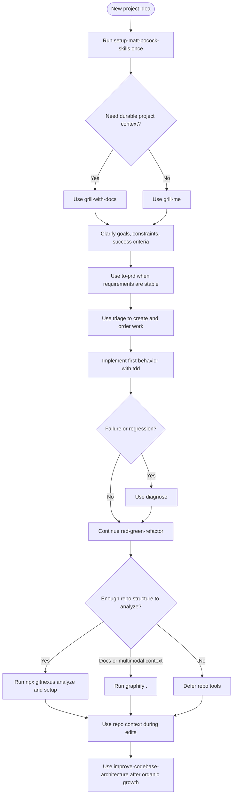

# Getting Started: New Project Workflow

Use this flow when you are starting from a product idea, prototype, or empty
repository. The goal is to establish project context before work starts, turn
stable requirements into ordered work, and then build the first behavior with
tests.

For skill details, see
[Engineering Skills Guide: Matt Pocock's `mattpocock/skills`](mattpocock-skills-guide.md).
For GitNexus and Graphify setup, verification, and gitignore guidance, see
[Repo Tools Guide: Choosing Between Graphify and GitNexus](repo-tools-guide.md).

## Install the workflow tools

Install the engineering skills and repository-analysis tools together:

```bash
./install-skills.sh --eng --repo-tools
```

This installs the `--eng` skills used for alignment, issue flow, TDD,
diagnosis, and architecture review. It also installs the `--repo-tools`
packages used for repository context.

## Bootstrap the project once

Run `setup-matt-pocock-skills` once in the new project before relying on the
other engineering skills. It provisions the agent-skills block and supporting
`docs/agents/` structure that the workflow skills expect.

For a brand-new project, run it before the first PRD, issue triage, or
implementation task.

## Recommended order

1. Run `setup-matt-pocock-skills` once.
2. Use `grill-me` to clarify intent, constraints, and success criteria.
3. Use `grill-with-docs` instead of `grill-me` when the decisions should
   become durable project context.
4. Use `to-prd` when the requirements are stable enough to write down.
5. Use `triage` to create, sort, and move work through an issue workflow.
6. Use `tdd` for the first behavior and continue with a red-green-refactor loop.
7. Use `diagnose` when a failure, regression, flaky behavior, or unclear
   symptom appears.
8. Use `improve-codebase-architecture` later, after enough structure exists to evaluate.

## Repository tools

Defer repository analysis until there is enough code or documentation to
inspect. In the earliest stage, the engineering skills matter more than repo
indexing.

Use GitNexus when active coding context becomes useful:

```bash
npx gitnexus analyze
npx gitnexus setup
```

Use Graphify when the useful context includes docs, diagrams, notes, research
artifacts, or other non-code material:

```bash
graphify .
```

Generated outputs such as `.gitnexus/` and `graphify-out/` are local analysis
artifacts by default. Do not treat them as source files to commit unless you
intentionally curate an output. Defer to
[Repo Tools Guide: Choosing Between Graphify and GitNexus](repo-tools-guide.md)
for gitignore and verification details.

## Flow



## When to move on

You are ready to leave the getting-started flow when the project has durable
context, ordered work, a tested first behavior, and enough repository structure
that GitNexus or Graphify can add useful context instead of indexing an empty
shell.
