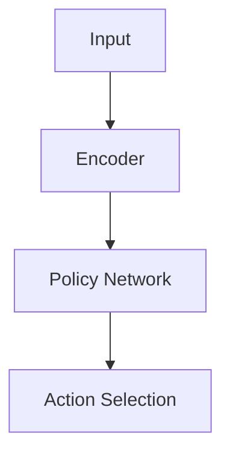

# Diagram Tool Selection Guide

Three tools are available for creating process maps and architecture diagrams in literature notes. Use this guide to choose the right one.

---

## Tool Comparison

| Tool | Best For | Output | Integration | Max Complexity |
|---|---|---|---|---|
| **Mermaid** | Flowcharts, sequence diagrams, decision trees, state machines | Inline code block in note | Renders natively in Obsidian reading view | ~20 nodes before readability degrades |
| **Excalidraw** | Spatial overviews, conceptual maps, hand-drawn aesthetic, simple architectures | `.excalidraw` file in `Files/Images/` | Opens in Obsidian via Excalidraw plugin | Medium complexity spatial layouts |
| **Drawio** | Complex architectures (>12 nodes), formula-heavy labels, IEEE-style figures, publication-quality output | `.drawio` + `.svg` export in `Files/Images/` | `.svg` embeds in Obsidian; `.drawio` opens in Draw.io | Unlimited (multi-page, stencils, themes) |
| **Inkscape** | Programmatic SVG creation, editing extracted figures, precise geometry, format conversion (SVG/PNG/PDF) | `.svg` + optional `.png` export in `Files/Images/` | `.svg` or `.png` embeds in Obsidian | Unlimited (full SVG spec, path ops via Inkscape engine) |

---

## Decision Logic

```
Is this editing/cleaning an EXISTING extracted figure?
  └── YES → Inkscape (open SVG, modify, re-export)

Is this creating a NEW diagram from scratch?
  ├── Sequential/branching (flowchart, algorithm, pipeline)?
  │     ├── ≤20 nodes → Mermaid (inline)
  │     └── >20 nodes or formula labels → Drawio (academic-paper route)
  ├── Spatial/conceptual?
  │     ├── Simple spatial layout → Excalidraw
  │     └── Complex architecture or publication quality → Drawio
  └── Programmatic/precise geometry (labeled blocks, arrows, exact positions)?
        └── Inkscape (harness REPL for shape-by-shape construction)

Is this a FALLBACK figure recreation (extraction failed)?
  └── YES → Inkscape (build simple block diagram programmatically)
```

### Always Create

- At least **1 Mermaid diagram** per literature note (for algorithm flowcharts, training pipelines, or method overviews)

### When to Add Drawio

- Paper describes a novel architecture with >12 components
- Diagram labels need mathematical notation (loss functions, equations)
- User explicitly requests publication-quality figures
- The paper's architecture involves multi-layer systems with typed connections
- Use the `academic-paper` route with `academic` or `academic-color` theme

### When to Add Excalidraw

- Simpler spatial layouts (≤10 components)
- Conceptual relationship maps
- When hand-drawn aesthetic is preferred
- Quick architectural overviews

---

## Invocation

### Mermaid

Write directly in the note as a fenced code block:

````markdown

````

Supported diagram types: `flowchart`, `sequenceDiagram`, `stateDiagram-v2`, `classDiagram`, `gantt`, `graph`.

### Excalidraw

Invoke the `/excalidraw` skill:
- Output: `Files/Images/{citationKey}-arch.excalidraw`
- Embed: `![[{citationKey}-arch.excalidraw]]`

### Drawio

Invoke the `/drawio` skill with the `academic-paper` route:
- Output: `Files/Images/{citationKey}-diagram.drawio` + `Files/Images/{citationKey}-diagram.svg`
- Embed the SVG: `![[{citationKey}-diagram.svg]]`
- The `.drawio` file is kept for future editing

### Inkscape (via `/inkscape` skill)

Invoke the `/inkscape` skill for the full command reference. Use the harness REPL for programmatic SVG creation or extracted figure editing:

**Creating a new diagram:**
```bash
echo '
document new --width 600 --height 300
shape rect --x 20 --y 100 --width 120 --height 60 --fill "#e3f2fd" --stroke "#1565c0" --stroke-width 2 --id block1
text add "Encoder" --x 80 --y 135 --anchor middle --fill "#1565c0" --font-size 14
shape rect --x 240 --y 100 --width 120 --height 60 --fill "#e8f5e9" --stroke "#2e7d32" --stroke-width 2 --id block2
text add "Decoder" --x 300 --y 135 --anchor middle --fill "#2e7d32" --font-size 14
shape line --x1 140 --y1 130 --x2 240 --y2 130 --stroke "#333" --stroke-width 2
export png Files/Images/{citationKey}-arch.png --dpi 200 --area drawing --background "#ffffff"
document save --path Files/Images/{citationKey}-arch.svg
quit
' | cli-anything-inkscape
```
- Output: `.svg` (editable) + `.png` (for Obsidian embed)
- Embed: `![[{citationKey}-arch.png]]`
- Keep `.svg` alongside for future editing

**Editing an extracted figure:**
```bash
echo '
document open Files/Images/{citationKey}-fig-1.svg
object list
style set some_label --fill black --font-family sans-serif
object delete unwanted_element
export png Files/Images/{citationKey}-fig-1.png --dpi 200 --area drawing --background "#ffffff"
document save
quit
' | cli-anything-inkscape
```

---

## Subagent Context (Batch Mode)

When running as a Summarizer subagent within the lit-summarizer batch pipeline:
- Subagents **cannot invoke skills** (`/drawio`, `/excalidraw`)
- The Orchestrator must **embed** the relevant skill instructions in the dispatch prompt
- Mermaid always works (it's just a code block, no skill needed)
- **Inkscape always works** — `cli-anything-inkscape` is a CLI tool invoked via Bash/REPL piping; subagents use it directly without orchestrator embedding. For standalone mode, invoke `/inkscape` for the full skill reference.
- For drawio/excalidraw, the Orchestrator reads the SKILL.md files and includes condensed instructions in the Summarizer prompt

When running as a standalone invocation (`/lit-summarizer-clc`):
- Can invoke `/drawio` and `/excalidraw` directly
- Can invoke `cli-anything-inkscape` directly (always available)
- This is the preferred approach for single-paper processing
